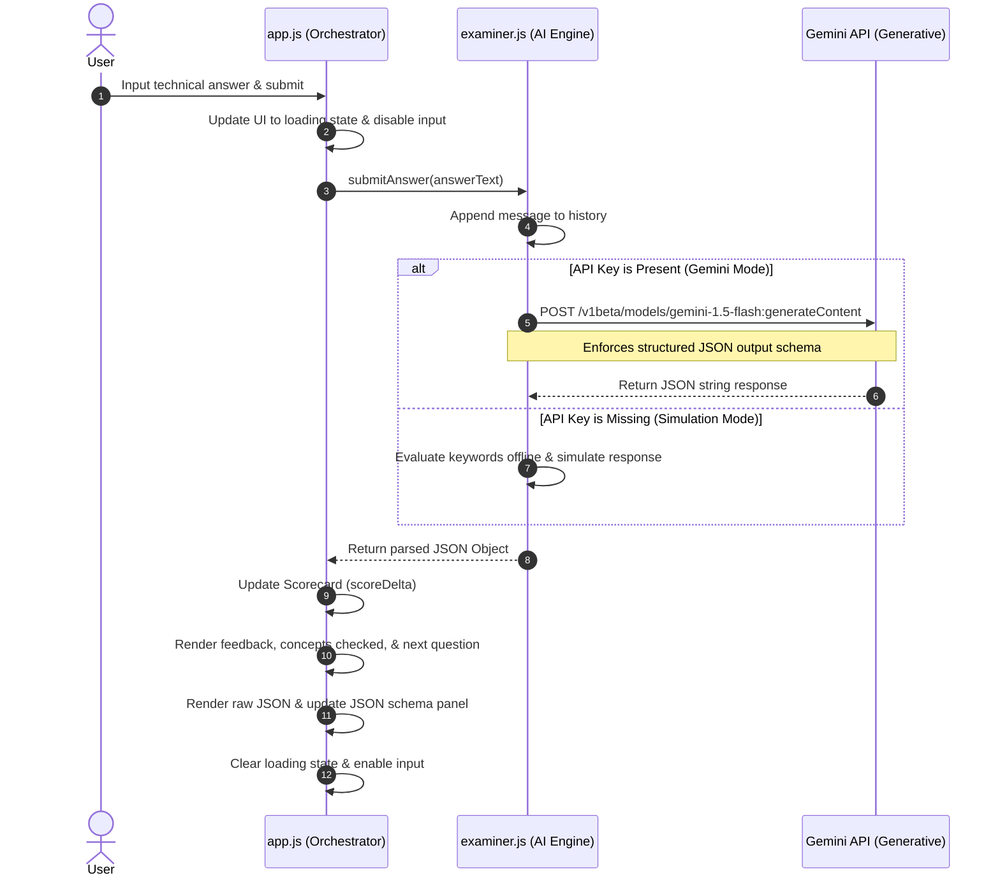
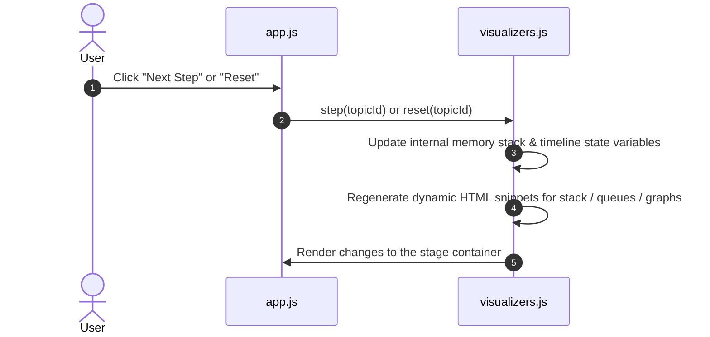

# High-Level Design (HLD): VivaSphere

## 1. Document Overview
This document describes the high-level system architecture, system modules, data flows, and security guidelines for **VivaSphere**. It serves as a guide for understanding how the core components of the codebase interact.

---

## 2. System Architecture Overview
VivaSphere is a client-side Single-Page Application (SPA) that operates entirely within the user's browser. It communicates with external systems only via HTTPS calls directly to the Google Gemini API.

### Key Architectural Characteristics
- **Zero Backend Server Dependency**: Serverless architecture from the application perspective. Static assets are served over HTTP, and all logic, state, and evaluation run locally in the browser.
- **API Key Sovereignty**: Gemini API keys are entered by the user and stored directly in `localStorage` in the browser.
- **Modular Monolith (JS)**: Separates orchestration (`app.js`), tech concept simulation/visualizers (`visualizers.js`), and LLM connection management (`examiner.js`).

---

## 3. High-Level Component Diagram
The system is divided into four main layers:

```mermaid
graph TD
    subgraph Browser Context (Client Side)
        UI[HTML5 / CSS3 Layout]
        App[app.js Orchestrator]
        Vis[visualizers.js Engines]
        Ex[examiner.js Engine]
        LS[(Browser Local Storage)]
    end

    subgraph External Services
        Gemini[Google Gemini API]
    end

    UI <-->|DOM Events / Rendering| App
    App <-->|Initialize / Trigger Step| Vis
    App <-->|Submit Answer / Control Session| Ex
    Ex <-->|Load / Save API Key| LS
    Ex <-->|HTTPS POST / JSON Schema| Gemini
```

---

## 4. Subsystem Decomposition

### 4.1. UI / Presentation Layer (`index.html` & `styles.css`)
- **SPA View Switcher**: Renders and toggles active views (`#view-study` and `#view-viva`) by adding/removing the CSS active class.
- **Aesthetic Design**: High-fidelity dark mode with custom fonts, glassmorphism (`backdrop-filter`), CSS variables for color tokens, pulsing states, and scrollable panels.

### 4.2. Orchestration Layer (`app.js`)
- **Event Coordination**: Binds DOM listeners for navigation, configuration inputs, buttons, and text submissions.
- **State Broker**: Tracks scores, streaks, and active views. Relays UI inputs to `Visualizers` and `Examiner` modules, and handles loading states.

### 4.3. Visualizer Engine (`visualizers.js`)
- **Sandboxed Simulations**: Controls the state and renders visual steps for closures, event loop, promises, hoisting, and git histories.
- **Canvas/DOM Rendering**: Dynamically outputs structured layouts, memory tables, call stack lists, and SVG version-control trees.

### 4.4. AI Examiner Engine (`examiner.js`)
- **State Manager**: Holds chat logs, focus topic, tone, difficulty, and API settings.
- **Generative Gateway**: Connects to the Gemini endpoint, enforces the system instructions, structures outputs, and performs evaluation checks.
- **Offline Simulator**: Rule-based backup response generator that mocks the examiner feedback loops when no API key is provided.

---

## 5. System Data Flows

### 5.1. AI Viva Evaluation Flow
This flow details what happens when a user submits an answer to an examiner question.



### 5.2. Study Lab Interaction Flow
This flow details stepping through code visualizer timelines.



---

## 6. Technology Stack Choice & Rationale

| Layer | Technology | Rationale |
| :--- | :--- | :--- |
| **Core Structure** | HTML5 | Semantics, accessibility, and high performance. |
| **Styling** | Vanilla CSS3 | Custom variables and flex/grid layout control. Fits requirements without Tailwind dependency. |
| **Client Logic** | Vanilla ES6+ JS | Direct DOM access, fast, light footprint, zero build-step compile. |
| **Framework (Optional Demo)** | React / JSX (`page.jsx`) | Present in workspace to demonstrate reusable modular components. |
| **API Boundary** | Fetch API / JSON | Native native promise-based requests, schema-based payloads. |
| **Storage** | Window LocalStorage | Simplest client-side solution for non-volatile key storage. |

---

## 7. Security, Privacy & Integrity
- **Key Protection**: Gemini API keys are never transmitted to any server besides the Google API Gateway (`generativelanguage.googleapis.com`).
- **Input Sanitization**: User-entered HTML strings in simulation/viva feedback are rendered via text nodes or validated before injection to prevent Cross-Site Scripting (XSS).
- **Session Lifecycle**: Reset actions wipe local history arrays in memory.
